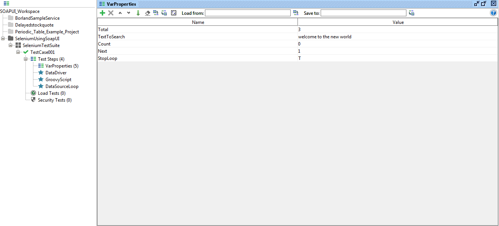

# 1.2.3 Data Driven Testing using SoapUI

We can run the selenium tests in soapUI by using groovy code along with test data stored in excel in the below format.

For the code base, please click [here](https://github.com/saikiran40cs/SoapUI) for more details.

